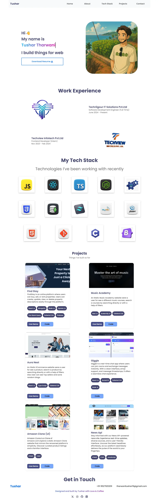

# Portfolio Website

Welcome to my portfolio website! This platform showcases my projects, technical expertise, and professional experience in web development.

## Live Preview

🌐 [View the live site here](https://tushartharwani.netlify.app/)

---

## Features

- **About Me**: Learn about my professional journey and technical skills.
- **Projects**: Explore my work with detailed descriptions and live previews.
- **Contact**: Easily get in touch through an integrated contact form.
- **Responsive Design**: Optimized for seamless viewing across devices.

---

## Technologies Used

- **Frontend**: React.js, HTML5, CSS3, JavaScript
- **Styling**: Tailwind CSS (or other framework, if applicable)
- **Hosting**: Netlify

---

## How to Use

1. Visit the live preview link above.
2. Navigate through sections to explore my work and expertise.
3. Use the contact form to reach out with any questions or opportunities.

---

## Feedback

Your feedback is always appreciated! Feel free to reach out through the contact form or connect via my [LinkedIn profile](https://www.linkedin.com/in/tushar-tharwani/) (update the link if necessary).

---

## License

This portfolio is for personal use. All rights reserved.

